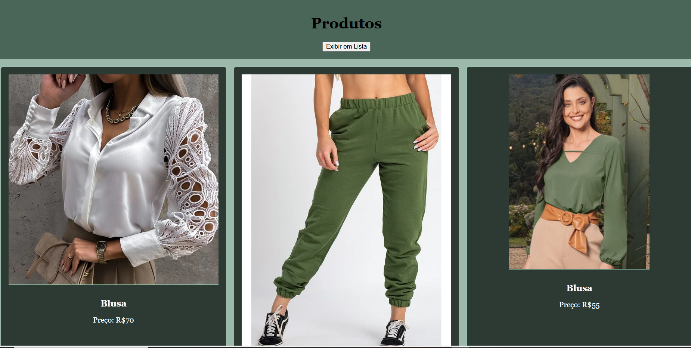

# DESAFIOS-PFE_AULA03

## Desafio 01 - Cards
- A: Renderize em uma página HTML em cards com as informações de produtos do arquivo **[produtos.json](./produtos.json)**, não é necessário que os cards contenham todas as informações do arquivo, mas é necessário que contenham a imagem, o nome e o preço do produto.
- B: Adicione responsividade à página, de forma que os cards sejam exibidos em uma única coluna em telas menores e em até 4 colunas em telas maiores, para testar acrescente mais produtos ao JSON.

## Desafio 02 - Lista
- A: Renderize em outra página HTML em lista com as informações de produtos do arquivo **[produtos.json](./produtos.json)**, não é necessário que a lista contenha todas as informações do arquivo, mas é necessário que contenha o nome e o preço do produto.

## Desafio 03 - UX (User Experience)
- A: Para melhorar a experiência do usuário, crie uma nova página html agora chamada **index.html** adicione dois botões no cabeçalho, um para exibir em cards e outro para exibir em lista os produtos do arquivo **[produtos.json](./produtos.json)**.

## Páginas HTML

